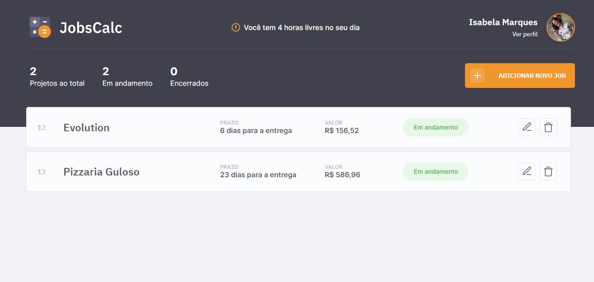
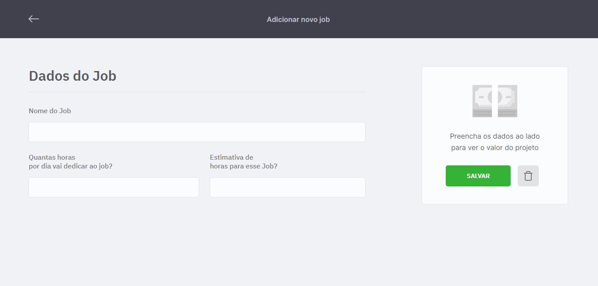
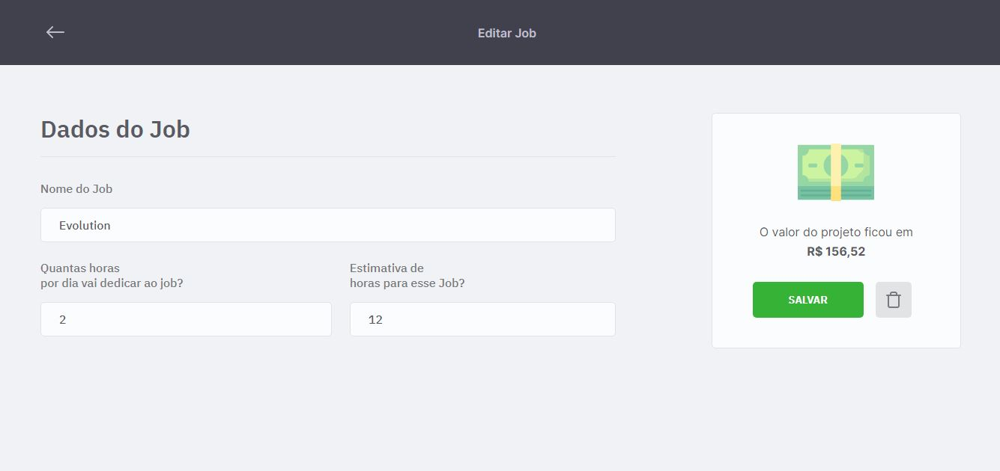
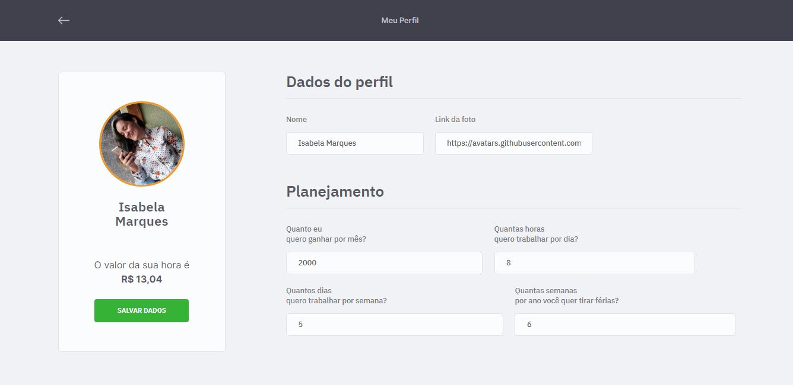

<h1 align="center">
  
</h1>

  <a href="#-tecnologias">Tecnologias</a>&nbsp;&nbsp;&nbsp;|&nbsp;&nbsp;&nbsp;
  <a href="#-projeto">Projeto</a>&nbsp;&nbsp;&nbsp;|&nbsp;&nbsp;&nbsp;
  <a href="#memo-licença">Licença</a>

 

  

## ⚙️ Tecnologias utilizadas

- HTML
- CSS
- JavaScript
- NodeJS
- EJS
- Express
- SQLite

## 💰 Projeto

O JobsCalc é uma aplicação que calcula o valor de trabalhos freelance de acordo com o preço/hora do freelancer. É possível criar e excluir trabalhos, além de poder editar o perfil e os próprios projetos.
Foi construído durante a 2ª Edição da maratona Discover da Rocketseat, com o objetivo de colocar em prática conceitos aprendidos durante aulas e trilhas da Discover.

## 🖥️ Telas da aplicação

### Home

  

### Adicionar Jobs

  

### Editar Jobs

  

### Perfil

  

## :memo: Licença

Esse projeto está sob a licença MIT. Veja o arquivo [LICENSE](.github/LICENSE.md) para mais detalhes.

